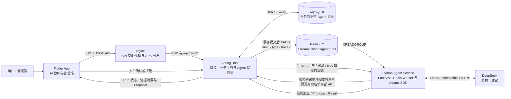
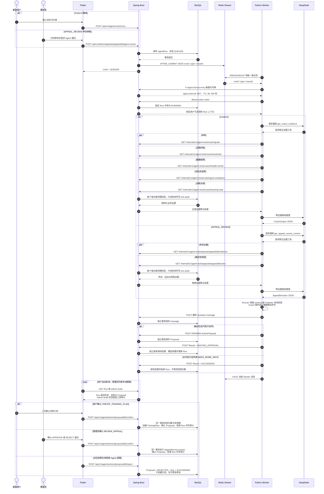

# FitLoop 系统架构与 Agent 时序

本文描述当前代码中的运行边界与双 Agent 链路。图以仓库实现为准，重点说明 Flutter、Spring Boot、MySQL、Redis Stream、Python Worker、DeepSeek、工具审计和人工确认之间的关系。

## 1. 系统架构

边界说明：

- Flutter 只调用 Spring Boot，不直连 Redis、Agent Service 或 DeepSeek。
- MySQL 是业务数据和 Agent 状态的权威来源。Redis Stream 只承载 `runId`、`type`、`traceId`，不保存完整输入或权威运行状态。
- Spring 在创建 `AgentRun` 的事务提交后才向 Stream 发布任务。发布失败时，补偿扫描会重新发布停留在 `QUEUED` 或 `FAILED_RETRYABLE` 的运行。
- Worker 不直连 MySQL。它先用 Agent 服务密钥换取 30–300 秒的委托 JWT，再以绑定 `runId`、用户、资源和运行类型的身份调用 Spring 白名单接口。
- DeepSeek 不直接调用 Spring。模型只能选择 Python 暴露的聚合工具；聚合工具再并发读取固定的 Spring 只读端点。
- Spring 为每个底层证据端点记录参数、结果、耗时和成功状态；单个 Run 最多允许 8 次底层工具调用。
- DeepSeek 只生成结构化建议。训练计划或申诉状态的真正写入由 Spring 在人工确认事务中完成。

## 2. 部署与故障边界

| 组件 | 当前基础 Compose 的宿主机绑定 | 角色与边界 |
| --- | --- | --- |
| Nginx | `${HTTP_PORT:-80}:80`；TLS overlay 可增加 `443` | 预期的公开 API 与 APK 入口 |
| Spring Boot | `${SERVER_PORT:-8080}:8080` | 核心业务 API；基础 Compose 未把宿主机绑定限制到回环地址 |
| MySQL | `127.0.0.1:${MYSQL_PORT:-3306}:3306` | 核心业务与 Agent 持久化 |
| Redis | `127.0.0.1:${REDIS_PORT:-6379}:6379` | Agent Stream 与排行榜投影；排行榜读取可回退 MySQL |
| Agent Service | `127.0.0.1:${AGENT_PORT:-8090}:8090` | Worker、`/health` 与 `/ready`，不经 Nginx 暴露 |
| DeepSeek | 仅出站 HTTPS | 模型推理，不持有业务写权限 |

基础 `deploy/docker-compose.yml` 会把 Spring 的宿主机端口绑定到所有接口；因此“只有 Nginx 对外”是目标部署边界，不是基础 Compose 自动保证的事实。公网环境必须通过安全组、防火墙或受审查的 Compose override 收敛 `8080`，并按 `docs/DEPLOYMENT.md` 完成 HTTPS 验证。

基础 Compose 和当前移动端兼容配置仍允许 HTTP；TLS overlay 才增加 `443`。本图展示可用的部署能力，不代表当前公网环境已经完成 HTTPS 验收。

Nginx 只依赖 Spring 的健康状态。Agent Service 或 DeepSeek 不可用时，Agent `/ready` 可以失败，但登录、运动、管理等核心 API 与 APK 下载仍由 Spring 和 Nginx 提供；MySQL 则是核心业务依赖，不能按同样方式降级。

Redis 也需要区分启动和运行阶段：基础 Compose 在冷启动时会用 Redis `healthy` 作为 Spring 与 Agent 的启动门禁；运行期间 Redis 故障时，排行榜读取可回退 MySQL，未发布的 Agent Run 保留在 MySQL 并等待补偿重发，但新的 Agent 任务无法被 Worker 正常消费。

## 3. 双 Agent 时序

判读时要区分以下状态：

- `message`、`proposal`、`result` 是 Worker 发出的三个独立 HTTP 请求，不构成一个跨请求事务。
- Coach 只有 `CREATE_TRAINING_PLAN` 且 `requiresAdmin=false` 的提案；只能由所属用户确认。
- Appeal 只有 `REVIEW_APPEAL` 且 `requiresAdmin=true` 的提案；必须由管理员确认。
- Proposal 默认 24 小时过期；Spring 会在加锁后再次校验状态、有效期和确认者权限。
- Appeal 的 `NEED_MORE_INFO` 不生成提案，Run 直接成功结束且申诉保持不变。
- “确认一个 `decision=REJECT` 的 Appeal 提案”会真正拒绝申诉；“拒绝 Agent 提案”只丢弃建议，不修改申诉。
- 拒绝提案后，Proposal 状态是 `REJECTED`，Run 状态仍是 `SUCCEEDED`。
- 工具审计记录的是 Spring 底层证据端点，不是完整 LLM 对话转录：Coach 通常产生 5 条，Appeal 通常产生 2 条。

## 4. 代码导航

| 关注点 | 主要入口 |
| --- | --- |
| Flutter 教练交互与确认 | `mobile/lib/features/coach/coach.dart` |
| Flutter 管理员申诉 Agent 与审计 | `mobile/lib/features/admin/admin.dart` |
| Flutter Agent HTTP 契约 | `mobile/lib/api_client.dart`、`mobile/lib/api_models.dart` |
| Spring 公开 Agent API | `backend/src/main/java/com/fitloop/agent/AgentController.java`、`AdminAgentController.java` |
| Run 状态机、Proposal 与人工确认事务 | `backend/src/main/java/com/fitloop/agent/AgentGatewayService.java` |
| Redis Stream 发布与补偿 | `backend/src/main/java/com/fitloop/agent/AgentQueuePublisher.java` |
| 委托令牌与内部 API | `backend/src/main/java/com/fitloop/agent/AgentDelegationTokenService.java`、`AgentInternalController.java` |
| 白名单证据工具与工具审计 | `backend/src/main/java/com/fitloop/agent/AgentToolController.java` |
| Worker 消费与回写 | `agent-service/src/fitloop_agent/worker.py`、`backend.py` |
| 聚合工具、护栏与结构化输出 | `agent-service/src/fitloop_agent/workflows.py`、`schemas.py` |
| DeepSeek 供应商适配 | `agent-service/src/fitloop_agent/provider.py` |
| 运行拓扑 | `deploy/docker-compose.yml`、`deploy/nginx.conf` |

可重复验证命令、预期证据和失败排查见 [Agent 可重复演示](AGENT_DEMO.md)；公网暴露、TLS 和秘密管理边界见 [部署与运维指南](DEPLOYMENT.md)。
